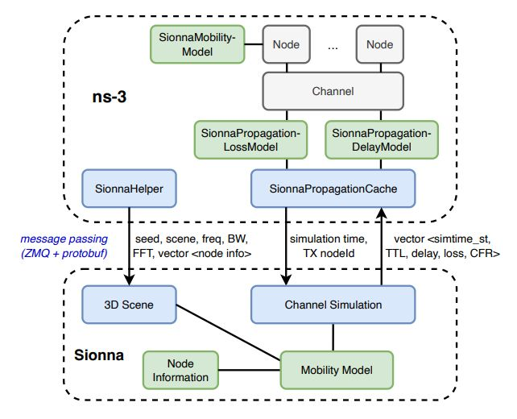
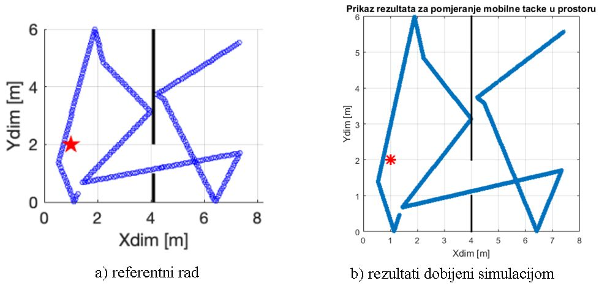

# Ns3-meets-Sionna-Using-Realistic-Channels-in-Network-Simulation

## Uvod
Simulacije predstavljaju nezaobilazan alat u razvoju i analizi komunikacionih mreža, jer omogućavaju izvođenje testova i eksperimenta u kontrolisanim i ponovljivim uslovima, bez potrebe za skupom fizičkom infrastrukturom. Ovakav pristup znatno olakšava modifikaciju parametara i proširenje mrežnih topologija u odnosu na stvarne mreže. Dok su raniji modeli često koristili pojednostavljene pretpostavke o propagaciji signala, savremeni zahtjevi modernih bežičnih tehnologija - naročito 5G i budućih 6G mreža, zahtijevaju primjenu realističnijih i sofisticiranijih modela kako bi se rezultati simulacija što bolje uskladili sa stvarnim uslovima.

Ovaj rad predstavlja nastavak i praktičnu primjenu prethodno razrađenih teorijskih koncepata. Fokus je stavljen na implementaciju i validaciju integracije Ns3Sionna modula unutar ns-3 okruženja, kao i na reprodukciju rezultata iz [referentnog rada](https://arxiv.org/pdf/2412.20524). Postavljanje i konfiguracija Ns3Sionna modula izvršena je na virtuelnoj mašini. Zatim su reprodukovane simulacije koristeći iste 3D scene i scenarije kao u referentnom radu. Također, sprovedeni su eksperimenti sa različitim parametrima mobilnosti i brojem tačaka, uz detaljnu analizu njihovog uticaja na dobijene rezultate. Na kraju je kreiran novi 3D scenarij, a performanse su evaluirane na osnovu mjernih metrika definisanih u referentnom radu.

## Postavka okružeja

Tradicionalni modeli u ns-3 simulatoru, kao što su Friisov model ili log-normal fading model, karakterišu se korištenjem pojednostavljenih matematičkih pristupa koji zanemaruju fizičke prepreke u prostoru (kao što su zidovi, namještaj ili zgrade), što često dovodi do nerealnih rezultata, naročito u zatvorenim i složenim okruženjima.

U radu predstavljen je softverski dodatak za ns-3 pod nazivom Ns3Sionna, koji omogućava realističnije simulacije bežičnih mreža korištenjem naprednog ray tracing modela za propagaciju signala. Integrisali su Sionna RT, biblioteku za ray tracing simulaciju elektromagnetnih talasa u trodimenzionalnom prostoru. Ova biblioteka omogućava detaljnu analizu načina na koji se signal reflektuje, raspršuje i apsorbuje u zavisnosti od materijala i geometrije prepreka u okruženju. Na osnovu izračunatih putanja talasa dobijaju se podaci o impulsnom odzivu kanala, koji se dalje koriste za izračunavanje frekvencijskog odziva kanala, gubitka jačine signala (path loss) i kašnjenja signala.

*Konceptualna shema NS3Sionna sistema je prikazana na slici 1 :*

 
Slika 1: Arhitektura NS3Sionna

Praktični dio realizovan je na virtuelnoj mašini s resursima: 16 CPU jezgri, 32 GB RAM i 64 GB prostora, što je timu omogućilo zajedničko razvojno okruženje. Prvi korak bio je integracija ns-3 simulatora s bibliotekom Sionna za izvođenje simulacija realističnih kanala fizičkog sloja, prateći uputstva iz GitHub repozitorija ns3sionna. Instalacija je obuhvatila preuzimanje ns-3 paketa, kloniranje repozitorija, instalaciju zavisnosti, konfiguraciju i pokretanje Sionna servera u Python virtualnom okruženju. Simulacije su pokretane više puta radi provjere konzistentnosti rezultata, uz obaveznu prethodnu aktivaciju Sionna servera za svako izvođenje.

Detaljne upute za integraciju ns-3 i Sionna dostupne su u [GitHub repozitoriju autora](https://github.com/tkn-tub/ns3sionna?tab=readme-ov-file). 

## Indoor scenario

Indoor scenarij prikazuje WiFi komunikaciju kroz dvoje otvorenih vrata između dvije sobe, pri čemu signal s pristupne tačke u lijevoj sobi mora proći kroz vrata i reflektovati se kako bi stigao do uređaja bez direktne vidljivosti, uz gubitke zbog refleksije i apsorpcije.

*Konceptualna shema Indoor scenarija je prikazana na slici 1 :*

 
Slika 2: Indoor scenario

## Outdoor scenario

Outdoor scenarij prikazuje WiFi komunikaciju u realističnom urbanom okruženju oko crkve Frauenkirche u Minhenu, gdje se klijentski uređaj nasumično kreće, a pristupna tačka je statična. Signal se često reflektuje od zgrada zbog nedostatka direktne vidljivosti, što uzrokuje povećano kašnjenje i gubitke.

 
Slika 3: Outdoor scenario

## Zaključak

U ovom radu uspješno je realizovana integracija Sionna biblioteke s ns-3 simulatorom korištenjem Ns3Sionna modula, čime je omogućeno izvođenje simulacija sa realističnim 3D kanalnim modelima. Simulacije u različitim scenarijima (indoor i outdoor) i evaluacija performansi sistema kroz variranje parametara potvrdile su da ova integracija omogućava znatno realističniju analizu u poređenju s tradicionalnim modelima propagacije.

Rezultati su pokazali visoku podudarnost sa referentnim radom, potvrđujući ispravnost konfiguracije i tačnost dobijenih rezultata. Mehanizmi poput keširanja i paralelnih proračuna pokazali su se ključnim za efikasnost, posebno u mrežama sa velikim brojem uređaja.

Dodatni doprinos rada ogleda se u kreiranju nove scene i izvođenju simulacija u korisnički definisanom okruženju, čime je potvrđena fleksibilnost pristupa i njegova primjenjivost u različitim scenarijima, uključujući buduće 6G sisteme.

Važno je naglasiti da ovakve simulacije zahtijevaju značajne hardverske resurse, naročito u scenarijima sa velikim brojem čvorova i visokom mobilnošću, zbog čestih i složenih proračuna kanala. Zbog toga pojedine simulacije nisu mogle biti završene, jer bi trajale predugo čak i na naprednim virtuelnim mašinama, što ukazuje na potrebu za dodatnim optimizacijama ili snažnijim resursima.

Zaključno, rad pokazuje da integracija ns-3 i Sionna biblioteke otvara nove mogućnosti za detaljnije i realističnije analize u istraživanju savremenih komunikacionih sistema.

